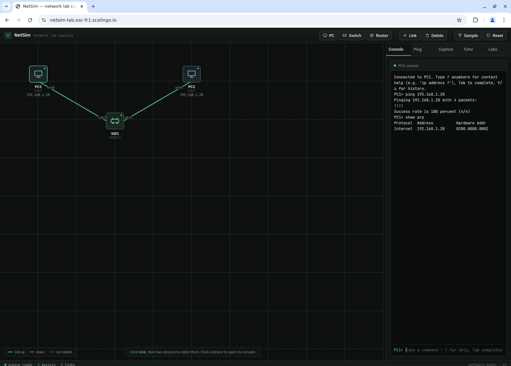
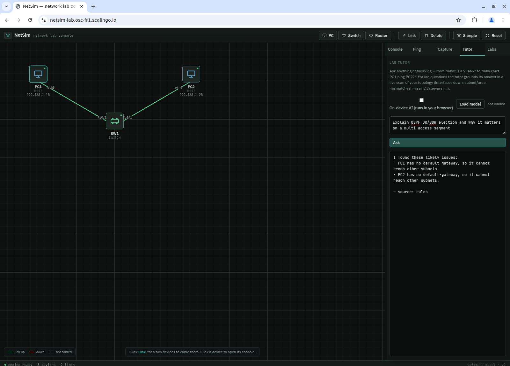
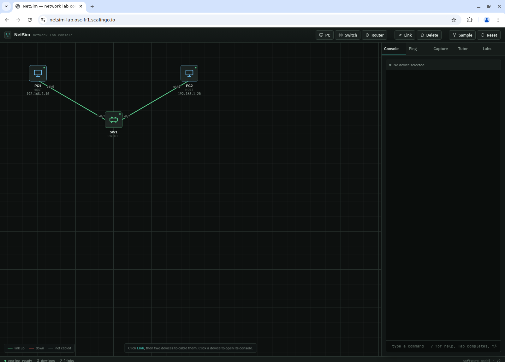

# LinkState

A browser-native platform for teaching, simulating, and automating networking behavior with a deterministic engine, an explainable CLI experience, and an AI-assisted tutor layer.

[](LICENSE)
[](https://www.python.org/)
[](https://fastapi.tiangolo.com/)
[](https://github.com/joxorsayan/netsim/actions/workflows/ci.yml)
[](https://github.com/joxorsayan/netsim/actions/workflows/netdevops.yml)


## Overview

LinkState is an open-source networking simulation and education platform designed for hands-on learning, rapid prototyping, and network automation experimentation. It combines a deterministic network engine with a browser-based interface so users can build topologies, configure devices, run reachability tests, export captures, and explore networking behavior without requiring a full lab environment.

The platform is intentionally practical: it emphasizes explainability, reproducibility, and educational value while supporting advanced use cases such as labs-as-code, state validation, and AI-assisted troubleshooting.


## Why this project exists

Modern networking education and engineering workflows often require a blend of theory, tooling, and quick feedback. Traditional simulators can be heavyweight, difficult to deploy, or limited in their ability to support automation and teaching in the same workflow.

LinkState addresses that gap by offering:

- a browser-first simulation experience
- a Cisco-style command interface for learning and experimentation
- a deterministic engine for reliable behavior and explanation
- a lightweight automation layer for config rendering and validation
- an AI tutor experience that helps users understand failures rather than simply report them

## Problem statement

Networking concepts are easier to understand when users can interact with them directly. However, many learning and validation environments are either too expensive, too complex, or too disconnected from real-world operational patterns.

LinkState aims to make foundational networking concepts accessible while still preserving enough realism to support routing, switching, security, wireless, WAN, and automation scenarios.

## Architecture overview

The system is organized into four primary layers:

1. Presentation layer
   - a browser-based topology editor, console, and capture experience
2. Application layer
   - FastAPI endpoints for topology management, CLI execution, packet analysis, labs, and automation
3. Simulation layer
   - a pure-Python engine that models switching, routing, security, DHCP, packets, and protocol behavior
4. Intelligence and automation layer
   - deterministic tutoring, lab grading, configuration rendering, validation, and optional AI-assisted explanations

A more detailed explanation is available in [docs/architecture.md](docs/architecture.md).

## Key capabilities

- Topology construction with hosts, switches, routers, and wireless components
- Cisco-style CLI interaction with context-aware help and config execution
- L2 and L3 protocol modeling including VLANs, STP, ARP, DHCP, OSPF, EIGRP, RIP, BGP, NAT, ACLs, IPv6, HSRP/VRRP, and EtherChannel
- Packet capture logging and .pcap export for Wireshark-compatible inspection
- Labs-as-code and auto-grading for guided exercises
- Automation support through a typed Python SDK and CLI
- AI-assisted tutor explanations grounded by deterministic findings

## Technology stack

- Python 3.12
- FastAPI and Uvicorn
- Vanilla JavaScript, HTML, and SVG for the browser UI
- Jinja2, PyYAML, and Typer for automation workflows
- ONNX and transformers.js for browser-based inference experiments
- Docker for portable deployment

## Repository structure

```text
app/                 Core FastAPI application and browser UI
app/engine/          Simulation, CLI, packet, tutoring, labs, and automation logic
automation/          Automation toolkit, SDK, templates, and deployment examples
ai/                  Data, training, and export pipeline for the tutor model
examples/            Runnable example workflows
tests/               Regression and feature coverage
docs/                Architecture notes and diagram specifications
```

## Installation

### Local development

```bash
git clone https://github.com/joxorsayan/netsim.git
cd netsim
python -m venv .venv
source .venv/bin/activate  # Windows: .venv\Scripts\activate
pip install -r requirements.txt
pip install -r automation/requirements.txt
```

### Running locally

```bash
uvicorn app.main:app --reload --host 0.0.0.0 --port 8000
```

Then open http://localhost:8000 and load the sample topology.

## Configuration

The service can run with default settings out of the box. The primary runtime behavior is controlled by the application state and the optional environment variables used by the tutor and automation components.

### Environment variables

- CF_API_TOKEN: optional Cloudflare AI token for hosted tutor fallback
- CF_ACCOUNT_ID: optional Cloudflare account identifier for AI fallback

## Docker deployment

A containerized deployment path is included for convenience.

```bash
docker build -t linkstate .
docker run -p 8000:8000 linkstate
```

Or with Docker Compose:

```bash
docker compose up --build
```

## API overview


The application exposes REST endpoints for:

- topology management
- device and link creation
- CLI execution
- ping and traceroute operations
- packet capture export
- tutor questions
- lab application and grading
- automation rendering, push, snapshot, drift, and validation

## Typical workflow

1. Launch the app and load or create a topology.
2. Add devices and links to model a network.
3. Configure interfaces and routing behavior through the CLI.
4. Validate reachability, observe packet capture, and inspect tutor guidance.
5. Apply labs, render automation templates, or validate intended state.

## Security and reliability

The platform is designed for educational and engineering use rather than as a full production-grade network control plane. The current runtime model uses in-memory workspace state, which is simple and deterministic but not intended to replace a distributed real-time control system.

The project emphasizes:

- deterministic simulation behavior
- clear separation between engine and UI concerns
- explainable validation and feedback
- safe, local-first operation for development and demonstrations

## Performance and scalability

The current implementation is optimized for interactive use and local deployment. The engine is lightweight, and the browser experience is responsive for small to medium topologies. Horizontal scaling will require shared state management because the workspace model is currently process-local.

## Roadmap

- persistence and shared workspaces
- richer wireless and WAN scenarios
- expanded automation workflows and declarative validation
- more polished deployment patterns for multi-user environments

## Screenshots







## Architecture and design notes

- [docs/architecture.md](docs/architecture.md)
- [docs/architecture-diagrams.md](docs/architecture-diagrams.md)

## Contributing

Contributions are welcome. Please open an issue or submit a pull request for bugs, educational labs, protocol enhancements, or documentation improvements.

## License

This project is licensed under the MIT License. See [LICENSE](LICENSE) for details.

## Acknowledgements

This project was built as a practical, open-source demonstration of how networking concepts can be modeled, explained, and automated in a single, approachable platform.
</content>
</invoke>
